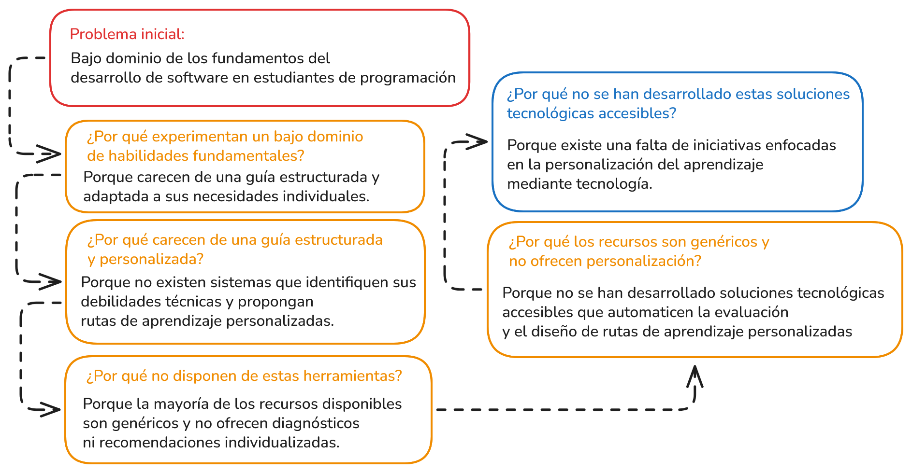
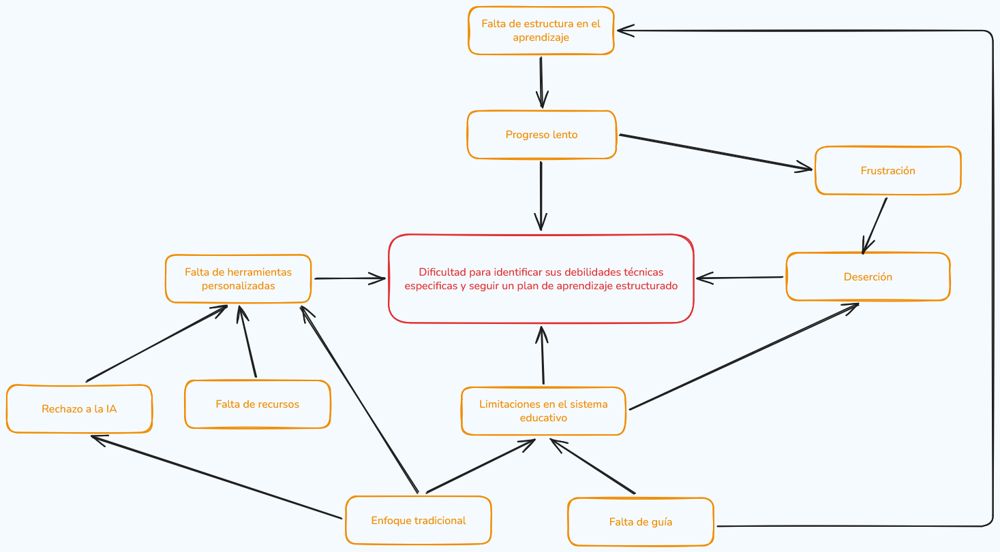
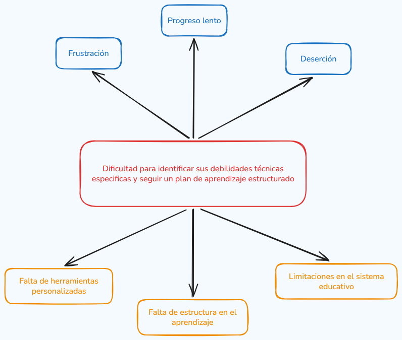

# Análisis de problema

Los estudiantes de programación se enfrentan a **dificultades para identificar sus debilidades técnicas especificas** y **seguir un plan de aprendizaje estructurado que se adapte a su nivel**. Esto genera **desmotivación, frustración, un progreso lento** en el desarrollo de hábilidades e incluso deserción.

## Aplicacion de 5 Whys? al problema

- **Problema inicial**:
    Los estudiantes de programación se enfrentan a dificultades para identificar sus debilidades técnicas específicas y seguir un plan de aprendizaje estructurado que se adapte a su nivel.

- **¿Por qué los estudiantes tienen dificultades para identificar sus debilidades específicas?**
    Porque no cuentan con herramientas que evalúen su nivel de conocimiento y les proporcionen retroalimentación personalizada.

- **¿Por qué no cuentan con herramientas que evalúen su nivel de conocimiento?**
    Porque los sistemas educativos tradicionales no suelen incluir evaluaciones dinámicas ni adaptativas.

- **¿Por qué los sistemas educativos no incluyen evaluaciones dinámicas ni adaptativas?**
    Porque diseñar e implementar este tipo de sistemas requiere tecnología avanzada y un enfoque personalizado que no siempre está disponible.

- **¿Por qué no se implementa esta tecnología avanzada en el aprendizaje de programación?**
    Porque puede haber una falta de recursos, conocimiento técnico o interés en desarrollar soluciones específicas para este problema.

- **¿Por qué hay una falta de recursos o interés en desarrollar estas soluciones?**
    Porque no se ha priorizado la personalización del aprendizaje como una necesidad crítica en la enseñanza de programación.

    

## Aplicacion de Mapa del Problema

- **Problema principal**:
    Los estudiantes de programación tienen dificultades para identificar sus debilidades técnicas específicas y seguir un plan de aprendizaje estructurado, lo que genera desmotivación, frustración, progreso lento e incluso deserción.

- **Causas principales y subcausas**:

  - **Falta de herramientas personalizadas**
    - No existen sistemas que evalúen el nivel de conocimiento de los estudiantes.
    - Las herramientas actuales no ofrecen retroalimentación adaptativa.
    - Los recursos educativos no están diseñados para ajustarse a las necesidades individuales.

  - **Falta de estructura en el aprendizaje**
    - Los estudiantes no tienen acceso a rutas de aprendizaje claras y progresivas.
    - Los planes de estudio no están diseñados para adaptarse a diferentes niveles de habilidad.
    - No hay un seguimiento continuo del progreso del estudiante.

  - **Desmotivación y frustración**
    - Los estudiantes no ven un progreso tangible en sus habilidades.
    - Las tareas o ejercicios son demasiado difíciles o demasiado fáciles.
    - Falta de apoyo o guía durante el proceso de aprendizaje.

  - **Limitaciones en el sistema educativo**
    - Enfoque tradicional en la enseñanza, sin personalización.
    - Falta de integración de tecnologías avanzadas como inteligencia artificial.
    - Recursos limitados para implementar soluciones innovadoras.

    

## Aplicación del Árbol del Problema

- **Problema central**:
    Los estudiantes de programación tienen dificultades para identificar sus debilidades técnicas específicas y seguir un plan de aprendizaje estructurado, lo que genera desmotivación, frustración, progreso lento e incluso deserción.

- **Causas principales**:

  - **Falta de herramientas personalizadas**:
    - No existen sistemas que evalúen el nivel de conocimiento de los estudiantes.
    - Las herramientas actuales no ofrecen retroalimentación adaptativa.
    - Los recursos educativos no están diseñados para ajustarse a las necesidades individuales.

  - **Falta de estructura en el aprendizaje**:
    - Los estudiantes no tienen acceso a rutas de aprendizaje claras y progresivas.
    - Los planes de estudio no están diseñados para adaptarse a diferentes niveles de habilidad.
    - No hay un seguimiento continuo del progreso del estudiante.

  - **Limitaciones en el sistema educativo**:
    - Enfoque tradicional en la enseñanza, sin personalización.
    - Falta de integración de tecnologías avanzadas como inteligencia artificial.
    - Recursos limitados para implementar soluciones innovadoras.

- **Efectos principales**:

  - **Desmotivación y frustración**:
    - Los estudiantes no ven un progreso tangible en sus habilidades.
    - Las tareas o ejercicios son demasiado difíciles o demasiado fáciles.
    - Falta de apoyo o guía durante el proceso de aprendizaje.

  - **Progreso lento en el desarrollo de habilidades**:
    - Los estudiantes no logran avanzar al ritmo esperado.
    - Se genera una brecha entre el nivel actual y el nivel deseado.

  - **Deserción**:
    - Los estudiantes abandonan los cursos o programas de aprendizaje.
    - Se reduce la cantidad de profesionales capacitados en programación.

    
