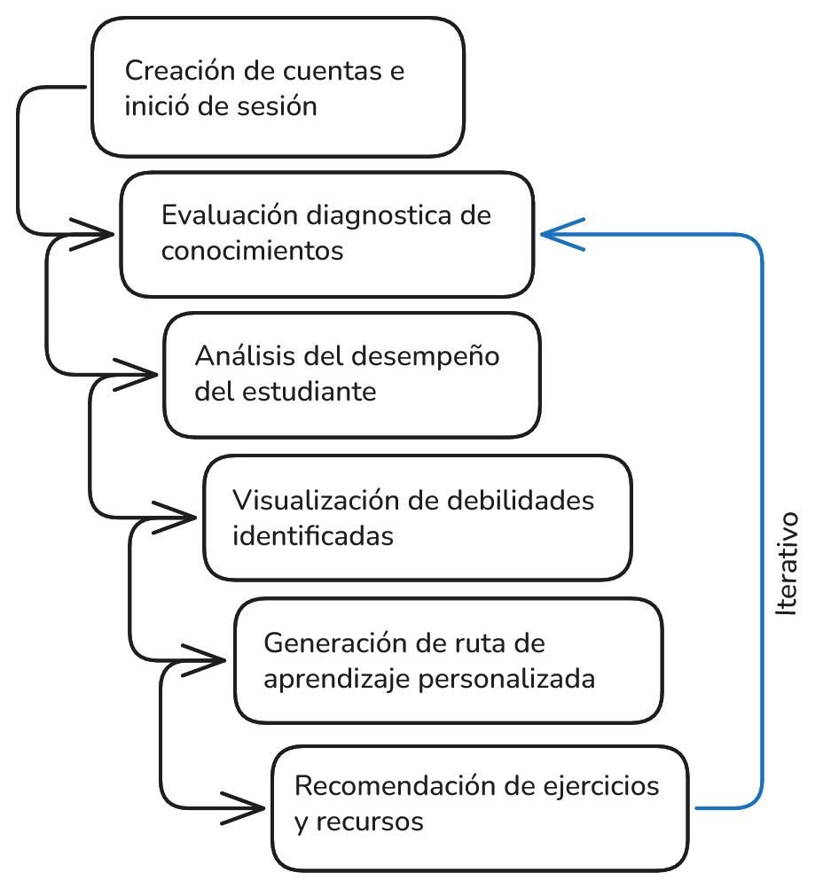

# Levantamiento de requisitos

## Requisitos funcionales

- RF-001: El sistema debe permitir a los estudiantes registrarse y crear un perfil.
- RF-002: El sistema debe permitir que los estudiantes realicen evaluaciones para diagnosticar sus fortalezas y debilidades.
- RF-003: El sistema debe analizar los resultados de las evaluaciones para clasificar al estudiante en una categoría de conocimiento (principiante, básico, intermedio, avanzado).
- RF-004: El sistema debe generar un plan de estudio personalizado basado en los resultados de la evaluación.
- RF-005: El sistema debe recomendar recursos de aprendizaje específicos (videos, artículos, ejercicios) según las debilidades identificadas.
- RF-006: El usuario debe poder acceder a su plan de estudio y recursos recomendados en cualquier momento.
- RF-007: El sistema debe permitir a los estudiantes visualizar sus debilidades y fortalezas.
- RF-008: El sistema debe permitir a los estudiantes realizar seguimiento del progreso mediante evaluaciones periódicas.
- RF-009: El sistema debe proporcionar retroalimentación personalizada después de cada evaluación.

## Requisitos no funcionales

- RNF-001: El sistema debe ser fácil de usar e intuitivo para estudiantes universitarios.
- RNF-002: El sistema debe ser confidencial y proteger la privacidad de los datos de los estudiantes.
- RNF-003: El sistema no debe permitir la modificación de los resultados de las evaluaciones por parte de los estudiantes.
